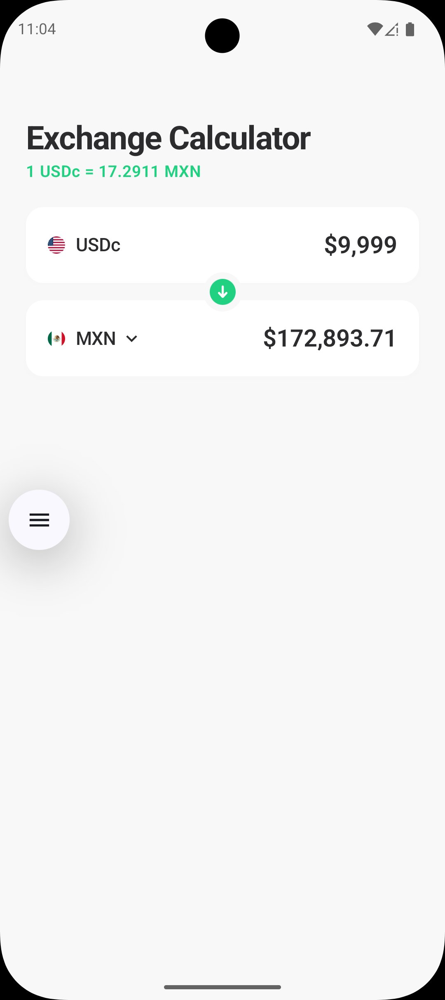
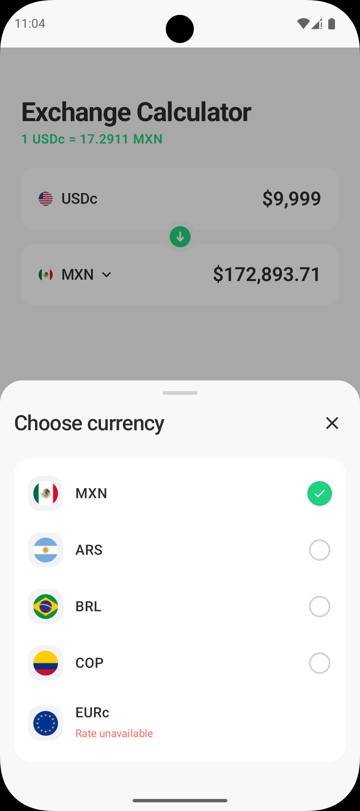
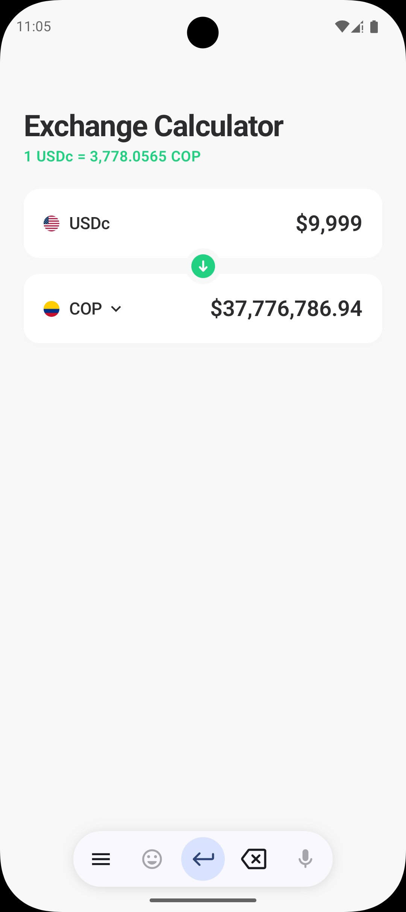
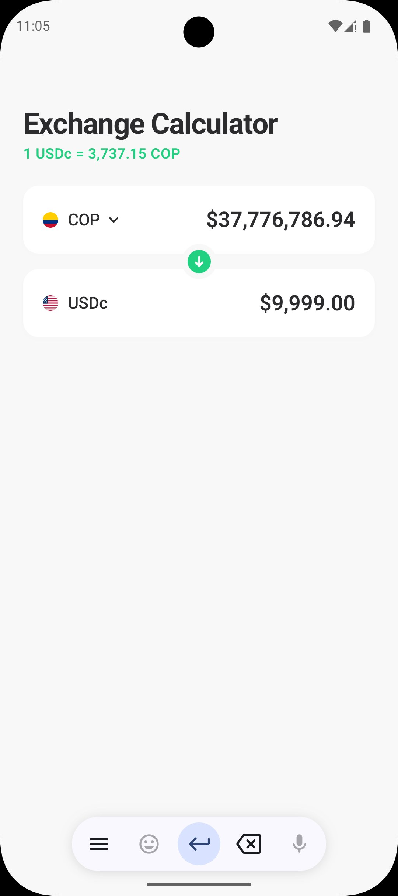

# 💱 Exchange Calculator

A production-ready Android currency exchange calculator that fetches **live exchange rates** from the [DolarApp API](https://api.dolarapp.dev/v1/). Built with modern Android architecture — Clean Architecture, MVVM, Jetpack Compose, and Hilt — following Google's recommended patterns throughout.

---

## 📸 Screenshots

<p align="center">
  
  &nbsp;&nbsp;
  
  &nbsp;&nbsp;
  
  &nbsp;&nbsp;
  
</p>

<p align="center">
  <em>Calculator screen &nbsp;·&nbsp; Currency picker &nbsp;·&nbsp; Large amounts (COP) &nbsp;·&nbsp; Swapped direction</em>
</p>

---

## 📱 Features

- **Live exchange rates** fetched from a real financial API
- **Ask / Bid rate semantics** — buying uses the ask rate, selling uses the bid rate, reflecting real FX market behaviour
- **5 supported currencies** — MXN, ARS, BRL, COP, EURc
- **Currency swap** — flip the conversion direction with a single tap; subtitle updates to reflect the new direction
- **Unavailable currency handling** — currencies the API returns as null (e.g. EURc) are shown in the picker with a "Rate unavailable" indicator
- **Real-time network monitoring** — detects connectivity loss via `NetworkCallback`; shows the appropriate screen immediately
- **Graceful error handling** — distinguishes network errors from server errors and routes to the correct UI state
- **Decimal input support** — full decimal keyboard with comma-formatted display
- **Splash screen** — Android 12+ native splash screen API
- **Deep link support** — `exchangecalculator://app/calculator`
- **Build flavors** — `dev`, `staging`, `prod` with environment-specific API URLs

---

## 🏗️ Architecture

The project follows **Clean Architecture** with a strict 3-layer separation. Dependencies only flow inward — `presentation → domain ← data`.

```
app/
├── data/                          # Data layer — API, DTOs, repositories
│   ├── datasource/
│   │   ├── CurrencyDataSource.kt          # Strategy interface
│   │   ├── HardcodedCurrencyDataSource.kt # Currency metadata (names, flags, API codes)
│   │   └── NetworkCurrencyDataSource.kt   # Live API implementation
│   ├── model/
│   │   └── ExchangeRateDto.kt             # API response model
│   ├── network/
│   │   ├── NetworkInterceptor.kt          # OkHttp interceptor (Accept header)
│   │   └── NetworkStateManager.kt         # NetworkCallback-based connectivity monitor
│   ├── remote/
│   │   └── ExchangeRateApi.kt             # Retrofit interface
│   └── repository/
│       └── CurrencyRepository.kt          # ICurrencyRepository implementation
│
├── domain/                        # Domain layer — pure Kotlin, zero Android imports
│   ├── error/
│   │   └── ExchangeErrorMapper.kt         # Exception → user message mapping
│   ├── exception/
│   │   └── ExchangeCalculatorException.kt # Typed exception hierarchy
│   ├── model/
│   │   ├── Currency.kt                    # Domain model (askRate, bidRate, isAvailable)
│   │   └── Result.kt                      # Sealed result wrapper
│   ├── network/
│   │   └── NetworkMonitor.kt              # Network state interface (domain contract)
│   ├── repo/
│   │   └── ICurrencyRepository.kt         # Repository contract
│   └── usecase/
│       ├── CalculateConversionUseCase.kt  # Ask/bid conversion logic
│       └── GetAvailableCurrenciesUseCase.kt
│
├── di/                            # Hilt dependency injection modules
│   ├── NetworkModule.kt
│   └── RepositoryModule.kt
│
└── presentation/                  # Presentation layer — Compose UI, ViewModel
    ├── component/                 # Reusable composables
    ├── navigation/                # NavGraph with deep links
    ├── screen/                    # Full screens (Calculator, Error, NoInternet, Loading)
    ├── ui/theme/                  # Material3 theme, colors, typography
    ├── utils/                     # Flag URL helpers
    └── viewmodel/
        ├── ExchangeCalculatorUiState.kt
        └── ExchangeCalculatorViewModel.kt
```

---

## 🔄 Data Flow (UDF)

The app strictly follows **Unidirectional Data Flow**:

```
User Event (tap, type)
        ↓
  ViewModel function
        ↓
  Use Case (business logic)
        ↓
  Repository → DataSource → API
        ↓
  Result<T> (Success / Failure)
        ↓
  updateUiState { copy(...) }
        ↓
  StateFlow<UiState> emits
        ↓
  Composable recomposes
```

The ViewModel exposes a single `StateFlow<ExchangeCalculatorUiState>`. All state mutations go through `copy()`. The UI never mutates state directly — it only sends events via lambda callbacks.

---

## 💹 FX Rate Semantics

Exchange rates follow real market conventions:

| Direction | Rate Used | Reason |
|-----------|-----------|--------|
| USDc → MXN | **Ask rate** | You are *buying* MXN — market charges the ask |
| MXN → USDc | **Bid rate** | You are *selling* MXN — market pays the bid |

The subtitle label updates accordingly:
- USDc on top → `1 USDc = 17.2550 MXN` (ask)
- MXN on top → `1 MXN = 0.0580 USDc` (1 / bid)

The spread between ask and bid is the exchange's margin, converting back and forth will not return the original amount exactly, which is the correct real-world behaviour.

---

## 🌐 API

**Base URL:** `https://api.dolarapp.dev/v1/`

### Fetch live exchange rates
```
GET /tickers?currencies=MXN,ARS,BRL,COP,EUR
```

**Response:**
```json
[
  {
    "ask": "17.2550000000",
    "bid": "17.2501000000",
    "book": "usdc_mxn",
    "date": "2026-05-07T00:19:29.752685791"
  },
  {
    "ask": "1465.2400000000",
    "bid": "1458.5844000000",
    "book": "usdc_ars",
    "date": "2026-05-07T00:19:29.755924266"
  },
  null,
  ...
]
```

> **Note:** The API may return `null` for some currencies (e.g. EURc/EUR) when they are temporarily unavailable. The app handles this gracefully — `null` entries are detected, and the currency is shown in the picker with a "Rate unavailable" label.

### Fetch available currency codes *(future)*
```
GET /tickers-currencies
```
This endpoint is not yet live. The app falls back to a hardcoded list of currency codes when it returns an error, and will automatically use the live list the moment the endpoint becomes available — no code changes required.

---

## 🧩 Key Technical Decisions

### 1. `ResponseBody` + Manual JSON Parsing
Retrofit's converter factories cannot handle arrays with null elements (`List<Dto?>`) due to type erasure at runtime. The solution is to return `Response<ResponseBody>` from Retrofit and parse the JSON manually using `kotlinx.serialization`'s `JsonArray` / `JsonObject` APIs. This gives full control over null handling without fighting the type system.

### 2. `code` vs `apiCode` separation in `HardcodedCurrencyDataSource`
The app displays `EURc` to users but the API expects `EUR`. A `SupportedCurrency` data class holds both:
- `code` — display code shown in the UI (`EURc`)
- `apiCode` — the code sent to the API endpoint (`EUR`)

This prevents the HTTP 500 error that would occur from sending `EURc` to the API.

### 3. `NetworkMonitor` as a domain interface
`NetworkStateManager` (data layer) implements `NetworkMonitor` (domain interface). The ViewModel depends on `NetworkMonitor` — never on `NetworkStateManager` directly. This keeps the domain layer free of Android SDK imports and makes the ViewModel fully testable with a mock.

### 4. `isAvailable` flag on `Currency`
Rather than filtering out unavailable currencies (which would make them disappear from the picker confusingly), every currency in `HardcodedCurrencyDataSource` is always returned. Those without a live rate from the API are marked `isAvailable = false` and rendered with a "Rate unavailable" badge in the picker. Selecting them is a no-op in the ViewModel.

### 5. `isNetworkError` flag in `UiState`
`UnknownHostException` (DNS failure / no internet) looks like a generic exception but should show `NoInternetScreen`, not `ErrorScreen`. The `ExchangeErrorMapper.isNetworkError()` function classifies the exception, and the ViewModel sets a dedicated `isNetworkError: Boolean` flag so the screen can route correctly without parsing error message strings.

### 6. Swap only flips a flag
`swapCurrencies()` only toggles `isUsdcOnTop: Boolean`. It does **not** move values between fields. `UiState` computed properties (`topRawDigits`, `bottomAmount`, etc.) read from the correct underlying field based on the flag. This eliminates the class of bugs where values became stale or lost after multiple swaps.

### 7. `CurrencyInputCard` keyboard stability
The soft keyboard closing after each keystroke was a known Compose issue caused by `remember(amount)` recreating `TextFieldValue` every time the ViewModel wrote back to `usdcRawDigits`. The fix: the ViewModel does **not** write `usdcRawDigits` during typing — only after the debounced calculation completes for the *other* field. `remember(currencyCode, amount)` then only resets when the currency changes (swap), not during typing.

---

## 🛠️ Tech Stack

| Category | Technology |
|----------|-----------|
| Language | Kotlin |
| UI | Jetpack Compose + Material3 |
| Architecture | Clean Architecture + MVVM + UDF |
| DI | Hilt |
| Networking | Retrofit + OkHttp |
| JSON | kotlinx.serialization |
| Navigation | Compose Navigation |
| Network monitoring | `ConnectivityManager.NetworkCallback` |
| Image loading | Coil |
| Splash screen | AndroidX Core Splashscreen |
| Unit testing | JUnit4 + Mockito + Turbine |
| UI testing | Compose Testing |
| Concurrency | Kotlin Coroutines + Flow |

---

## 🚀 Setup

### Prerequisites

- Android Studio Hedgehog or later
- JDK 17
- Android SDK with API 26+ (minSdk) and API 36 (compileSdk)
- A physical device or emulator with internet access

### Clone and build

```bash
git clone https://github.com/your-username/ExchangeCalculator.git
cd ExchangeCalculator
```

### Keystore setup

The project requires keystores for signing. Create the `keystore/` directory in the project root:

```bash
mkdir keystore

# Generate debug keystore (if you don't have one)
keytool -genkeypair \
  -keystore keystore/debug.keystore \
  -storepass android \
  -alias androiddebugkey \
  -keypass android \
  -keyalg RSA \
  -keysize 2048 \
  -validity 10000 \
  -dname "CN=Android Debug,O=Android,C=US"
```

For release builds, provide the release keystore and set these in `local.properties` or as environment variables:

```properties
# local.properties
KEYSTORE_PASSWORD=your_keystore_password
KEY_ALIAS=your_key_alias
KEY_PASSWORD=your_key_password
```

### API configuration

The API base URL defaults to `https://api.dolarapp.dev/v1/`. To override it, add to `local.properties`:

```properties
API_BASE_URL=https://your-custom-api.com/v1/
```

### Build and run

```bash
# Debug build (dev flavor)
./gradlew installDevDebug

# Release build (prod flavor)
./gradlew assembleProdRelease

# Run unit tests
./gradlew test

# Run instrumented UI tests (requires connected device/emulator)
./gradlew connectedDevDebugAndroidTest
```

---

## 🏗️ Build Variants

The app has three product flavors:

| Flavor | Application ID | Purpose |
|--------|----------------|---------|
| `dev` | `com.exchangecalculator.app.dev` | Development — logging enabled |
| `staging` | `com.exchangecalculator.app.staging` | QA / pre-production testing |
| `prod` | `com.exchangecalculator.app` | Production release |

Combined with `debug` / `release` build types, this gives 6 variants. All three flavors currently point to the same API base URL, which can be overridden per-flavor in `build.gradle.kts`.

---

## 🧪 Testing

### Unit tests — `src/test/`

| Test class | What it covers |
|-----------|----------------|
| `CalculateConversionUseCaseTest` | Ask rate for buy direction, bid rate for sell, negative amounts, zero rates, ask/bid spread |
| `ExchangeRateDtoTest` | `getCurrencyCode()`, `isValid()`, default constructor |
| `HardcodedCurrencyDataSourceTest` | `code`/`apiCode` separation, case-insensitive lookup, EURc→EUR mapping |
| `ExchangeCalculatorViewModelTest` | Load, retry, swap, select currency, network error flag, UiState computed properties |

```bash
./gradlew test
```

### Instrumented UI tests — `src/androidTest/`

| Test class | What it covers |
|-----------|----------------|
| `ExchangeCalculatorScreenTest` | Error screen, NoInternet screen, retry callbacks |
| `CurrencyPickerBottomSheetTest` | Title, currency list, selection callback, unavailable badge, dismiss |

```bash
./gradlew connectedDevDebugAndroidTest
```

---

## 📡 Network Behaviour

| Scenario | Behaviour |
|----------|-----------|
| First launch, online | Fetches live rates → shows calculator |
| First launch, offline | `UnknownHostException` caught → `NoInternetScreen` shown |
| Loaded, goes offline | `NetworkCallback.onLost()` fires → `isNetworkAvailable = false` updated reactively |
| API returns HTTP error | Error message shown; user can retry |
| API returns null for a currency | Currency shown as "Rate unavailable" in picker |
| `tickers-currencies` API unavailable | Falls back to hardcoded currency code list silently |

---

## 📦 Supported Currencies

| Code | API Code | Name | Flag |
|------|----------|------|------|
| MXN | MXN | Mexican Peso | 🇲🇽 |
| ARS | ARS | Argentine Peso | 🇦🇷 |
| BRL | BRL | Brazilian Real | 🇧🇷 |
| COP | COP | Colombian Peso | 🇨🇴 |
| EURc | EUR | Euro | 🇪🇺 |

> EURc uses a separate display code (`EURc`) from its API code (`EUR`) because the DolarApp API identifies stablecoins differently from their underlying currencies. The app translates between these internally.

---

## 🔌 Adding a New Currency

When the `tickers-currencies` API goes live or a new currency needs to be added:

1. Add an entry to `HardcodedCurrencyDataSource.supportedCurrencies`:

```kotlin
SupportedCurrency(code = "GBP", apiCode = "GBP", name = "British Pound", flagEmoji = "🇬🇧")
```

2. Add a `getCountryCode()` mapping in `CurrencyUtils.kt`:

```kotlin
"GBP" -> "gb"
```

That's it. No other changes required — the network layer, repository, ViewModel, and UI all handle it automatically.

---

## 🔗 Deep Links

The app supports deep linking to the calculator screen:

```
exchangecalculator://app/calculator
```

Test with ADB:
```bash
adb shell am start \
  -W -a android.intent.action.VIEW \
  -d "exchangecalculator://app/calculator" \
  com.exchangecalculator.app.dev
```

---

## 🔒 ProGuard

Release builds use R8 with the bundled `proguard-rules.pro`. The configuration preserves:
- Retrofit interfaces and annotations
- kotlinx.serialization classes
- Hilt generated components
- OkHttp / Okio internals

---

## 📋 Requirements

| Requirement | Value |
|------------|-------|
| Minimum SDK | API 26 (Android 8.0 Oreo) |
| Target SDK | API 36 |
| Compile SDK | API 36 |
| Kotlin | 1.9.22 |
| Java compatibility | 17 |

---

